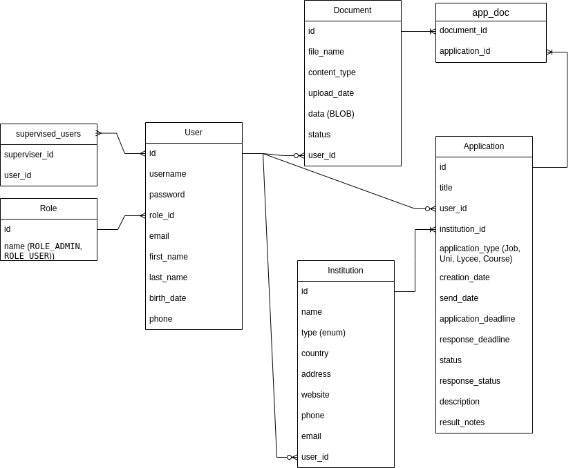

# EduJob Application Tracker info
This project is a Spring Boot + Thymeleaf MVC web application that allows users to track applications for jobs, universities, lycees or courses. Users can manage multiple applications, track required documents, deadlines, interviews, and application status. Users can also add supervisors (e.g., parents or career advisors) to oversee their application progress.
The project is designed to demonstrate full-stack Spring Boot skills, including MVC architecture, JPA relationships, form validation, authentication, file upload, and deployment using Docker with an Oracle database.

### Project description
- Track applications for jobs, universities, lycées, and courses.
- Users can be students or job seekers.
- Supervisors (like parents or career consultants) can monitor applications.
- Track required documents, deadlines, interviews, and responses.
- Upload and store documents (PDFs) in Oracle BLOBs.
- Notifications for upcoming deadlines/interviews.

### Features
List main features (high-priority first):
- User registration and login (Spring Security)
- Role-based access (ADMIN, USER)
- Supervisor management (users can add supervisors)
- Application CRUD
- Document upload (PDFs stored in Oracle BLOBs)
- Many-to-many relationships (Application ↔ Documents, User ↔ Supervisors)
- Institution management (universities, employers, lycées, courses)
- Dashboard showing applications, documents, and notifications

### Technical stack
- Backend: Spring Boot 3.x
- Frontend: Thymeleaf, HTML, CSS, JavaScript
- Database: Oracle (Docker container)
- ORM: JPA / Hibernate
- Authentication: Spring Security (login, session management)
- Validation: @Valid, @NotNull, @Size, etc.
- Build: Maven, executable JAR
- Development tools: DBeaver, Docker

### DB Schema

Describe entities and relationships briefly (or refer to ERD):
- Users: 
-- id: Long, primary key, auto-generated
-- username: String, unique, not null (used for login)
-- password: String, not null (hashed via Spring Security)
-- email: String, not null, validated as email
-- firstName, lastName: String, not null
-- birthDate: LocalDate, optional
-- phone: String, optional
-- role_id: foreign key → roles.id (Many-to-One)
Relationships:
--Supervisors / Supervised Users: Self-referencing Many-to-Many through user_supervisor join table
--Applications: One-to-Many (User → Application)
- Roles: ADMIN, USER
-- id: Long, primary key, auto-generated
-- name: String, unique, not null (e.g., ADMIN, USER)
Relationships:
-- Users: One-to-Many (Role → User) — each user is assigned exactly one role.
- Applications: track submissions and deadlines
-- id: Long, primary key, auto-generated
-- title: String, not null — application title
-- description: String (up to 5000 chars) — optional description
-- user_id: Long, foreign key → users.id — owner of the application
-- institution_id: Long, foreign key → institutions.id — related institution
-- applicationType: ENUM (JOB / UNIVERSITY / LYCEE / COURSE)
-- creationDate: LocalDate — automatically set on creation
-- submitDate, submitDeadline, responseDeadline: LocalDate — track submission and response deadlines
-- status: ENUM (PLANNED, SUBMITTED, ACCEPTED, REJECTED, etc.)
-- responseStatus: ENUM (tracks response/result)
-- resultNotes: String (up to 2000 chars) — optional notes
Relationships:
-- Many-to-One: User → Application (each application belongs to a single user)
-- Many-to-One: Institution → Application (application linked to an institution)
-- Many-to-Many: Application ↔ Document via app_doc join table (each application can have multiple documents, and each document can be linked to multiple applications)
- Documents: uploaded PDFs, reusable across applications
-- id: Long, primary key, auto-generated
-- fileName: String, not null — name of the file
-- contentType: String, not null — file MIME type (pdf, image, etc.)
-- uploadDate: LocalDate — date when file was uploaded
-- data: BLOB — file content stored in Oracle BLOB
-- status: ENUM (READY, NOT_READY, IN_PROGRESS)
Relationships:
-- Many-to-One: User → Document (uploader/owner of the document)
-- Many-to-Many: Document ↔ Application via app_doc join table (documents can be attached to multiple applications)
- Institutions: universities, employers, lycées, courses
-- id: Long, primary key, auto-generated
-- name: String, not null — institution name
-- type: ENUM (InstitutionType), not null — JOB / UNIVERSITY / LYCEE / COURSE
-- country: String — country of institution
-- address: String — full address
-- website: String — URL of institution
-- phone: String — contact phone number
-- email: String — contact email, validated with @Email
-- user_id: Long — owner/creator of the institution (optional)
Relationships:
-- One-to-Many: Institution → Application (an institution can have multiple applications linked)
-- Many-to-One: User → Institution (user who added/created the institution)
- Join tables: app_doc
-- application_id: Long, foreign key → applications.id
-- document_id: Long, foreign key → documents.id


### Prerequisites
- Java 21
- Maven
- Docker (Oracle container running)
- DBeaver or any Oracle client (optional)

# Project setup and run instructions
1. Clone the repository:
`git clone <repo-url>`
2. Switch to your feature branch:
   git checkout <branch-name>
3. Configure application.properties:
   spring.datasource.url=jdbc:oracle:thin:@localhost:1521/XEPDB1
   spring.datasource.username=app_tracker
   spring.datasource.password=MyStrongPassword123
4. Run Oracle container (if not already running)
5. Build and run the application:
   mvn clean package
   java -jar target/app-tracker-0.0.1-SNAPSHOT.jar
6. Access in browser: http://localhost:8080


## Step 1: Install Docker (if you don’t have it)

Because Oracle XE is too heavy to install manually — Docker is required.

## Step 2: Download the repository OR just download docker-compose.yml

The repo contains a docker-compose.yml like:

version: '3.8'
services:
  oracle:
    image: gvenzl/oracle-xe
    container_name: oracle-xe
    ports:
      - "1521:1521"
    environment:
      ORACLE_PASSWORD: Admin123
    volumes:
      - oracle-data:/opt/oracle/oradata

volumes:
  oracle-data:

Run:

```docker compose up -d```


This starts a clean Oracle XE instance.

## Step 3: Create your project schema

Run your SQL script:

```schema.sql```


```docker exec -i oracle-xe sqlplus sys/Admin123@XEPDB1 as sysdba < schema.sql```


This creates:

Schema: app_tracker

Role table

Admin user (hashed password)

Any required sequences or indexes

## Step 4: Run your application

Download JAR file:

application-tracker-1.0.0.jar


Then run it:

```java -jar application-tracker-1.0.0.jar```


Now connect the app to the Oracle container:

spring.datasource.url=jdbc:oracle:thin:@localhost:1521/XEPDB1
spring.datasource.username=app_tracker
spring.datasource.password=AppTracker123


Open browser:

http://localhost:8080


And your application works

# Usage
- Register a new user or login
- Add a supervisor (if applicable)
- Create applications and attach documents
- Track status, deadlines, and upcoming interviews
- View dashboards and notifications

# Future possible enhasements (TODO)
- Email notifications for deadlines/interviews
- Advanced search/filter for applications
- Export application data to PDF/Excel
- Integration with external APIs (universities or employers)

